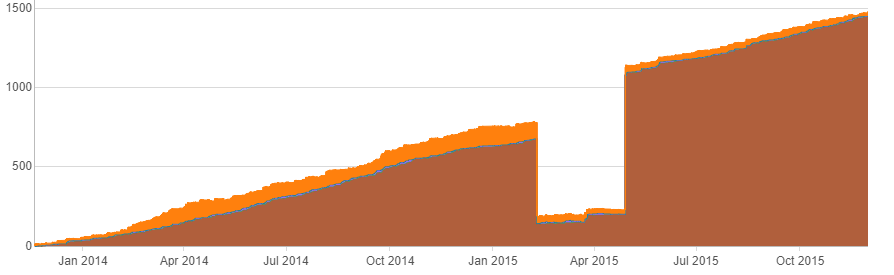
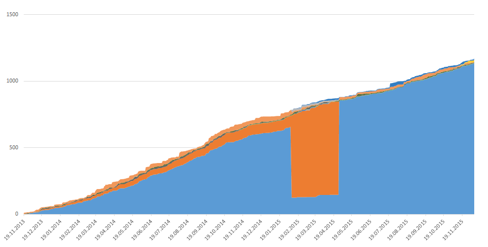
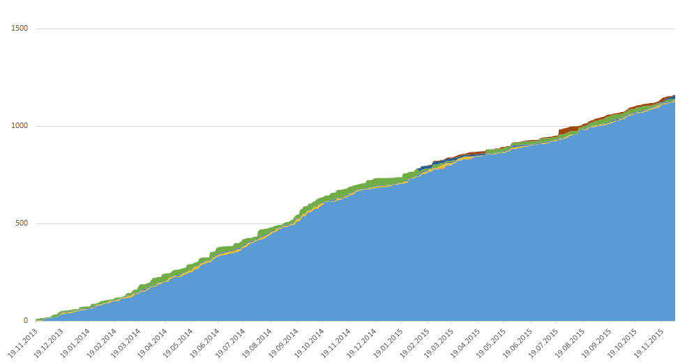
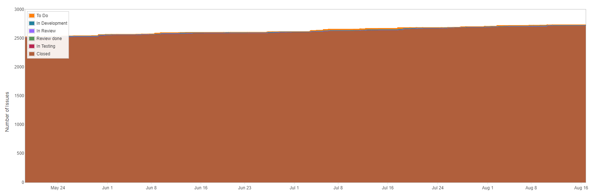
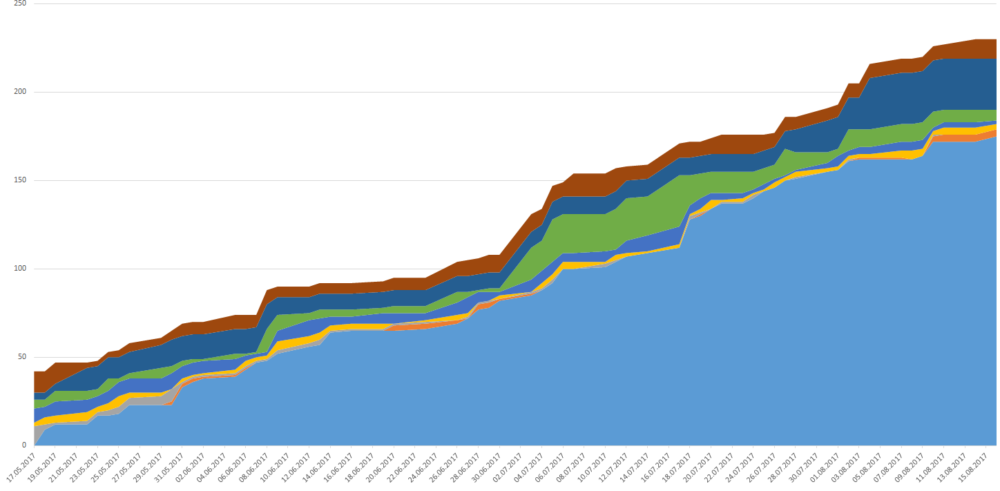

# How fast you are going #
This is a library that helps analyze data from JIRA. Once connected to JIRA, it pulls all issue data for requested project to cache. This allows very quick data analysis without requirement to pull data from server each time you run your project. Moreover if any data was updated in JIRA it will be automatically synchronized with local cache - only issues that did change will be pulled from the server.

### Features
1. Caching JIRA data locally
2. Easy to get any data regarding your project instantly
3. Some classes to help calculate data like `CFD`, `cycle time` etc. .
4. [Examples](howfastyouaregoing-examples/src/main/java/pl/kaszaq/howfastyouaregoing/examples/) with sample data.

### Binaries
Library is available in [](https://maven-badges.herokuapp.com/maven-central/pl.kaszaq.howfastyouaregoing/howfastyouaregoing-core)

```xml
<dependency>
    <groupId>pl.kaszaq.howfastyouaregoing</groupId>
    <artifactId>howfastyouaregoing-core</artifactId>
    <version>0.2</version>
</dependency>
```


### Sample code
This code will read all labels of project `MYAWESOMEPROJECT` from JIRA under url `http://localhost:8080/`
```java
// configure jira data provider
AgileProjectProvider agileProjectProvider = JiraAgileProjectProviderBuilderFactory
                .withJsession("cookievalue")
                .withCacheDir(new File("src/main/resources/cache/"))
                .withJiraUrl("http://localhost:8080/")
                .build();

// configure client
AgileClient agileClient = AgileClientFactory.newClient()
                .withAgileProjectProvider(agileProjectProvider)
                .create();

// get set of all labels used in project MYAWESOMEPROJECT
Set<String> labels = 
	agileClient.getAgileProject("MYAWESOMEPROJECT").getAllIssues().stream()
	.flatMap(issue -> issue.getLabels().stream())
	.collect(Collectors.toSet())
```

### Motivation
Initially I had problem with JIRA - as awesome as this tool is it does lack in terms of data analysis and visualisation.
For instance for some reason my CFD drawn by JIRA had a huge gap for reason unknown to me.



After I wrote this tool I understood why - JIRA does draw CFD using only currently used statuses, 
ignoring those that were removed. CFD drawn in excel from data generated from this tool does not do that.



Moreover it has ability to map statuses from one to another, meaning that if you had used in past status `Resolved` 
you can map it to currently used `Closed` and while working with data you will no longer have to
care about `Resolved` as you will only have `Closed`. After such mapping CFD drawn from data generated by this tool
 will look like this:



Another thing I didnt like in JIRA was trying to learn from CFD narrowed to last 3 months. 
Looking at this can you tell me what was my throughput? How many items we in progress?



This is much better:



After these I started to increase capabilities of this library to be able to get 
much more insight than it is visible in JIRA - to make it easy to calculate wip, cycle time, 
throughput, wait time, flow efficiency etc. or anything else you would like to know.

**I want to add visualisation of all that data out of box.**

### Examples

Some [Examples](howfastyouaregoing-examples/src/main/java/pl/kaszaq/howfastyouaregoing/examples/) are available
but these still lack proper explanation. 

### Code quality is...
I am quite ashamed of this code and its quality. Currently I consider it to be a far alpha stage as I am moving 
packages/interfaces quite often. Not to mention any tests that are just absent...

However I was told by a friend of mine
> it doesn't matter, it **WORKS**, **does what we need it to do** I use it, its awesome. It is better that you share it now, than to keep it till it is perfect as others **can use it already** - and that what it is all about.

I want to make it better. But I agree with the above and and that is why it is here.
 
It is not perfect but it does what I wanted it to do so maybe other will find it useful as well.

### Contribution guidelines ###
If you think you can contribute something please create an issue with description of the problem so we could discuss it. You can also make just a merge request but then we might get a feature/code collision.

### Feedback

I'd really love to hear your feedback - if you can please give me one using [issue tracker](https://bitbucket.org/kaszaq/howfastyouaregoing/issues)

### License
Copyright 2017 Michał Kasza

Licensed under the Apache License, Version 2.0 (the "License");
you may not use this file except in compliance with the License.
You may obtain a copy of the License at

    http://www.apache.org/licenses/LICENSE-2.0

Unless required by applicable law or agreed to in writing, software
distributed under the License is distributed on an "AS IS" BASIS,
WITHOUT WARRANTIES OR CONDITIONS OF ANY KIND, either express or implied.
See the License for the specific language governing permissions and
limitations under the License.
